Step 1:  Follow the activate your account link in your welcome mail.  Also take note of the Cloud Account name as highlighted below 

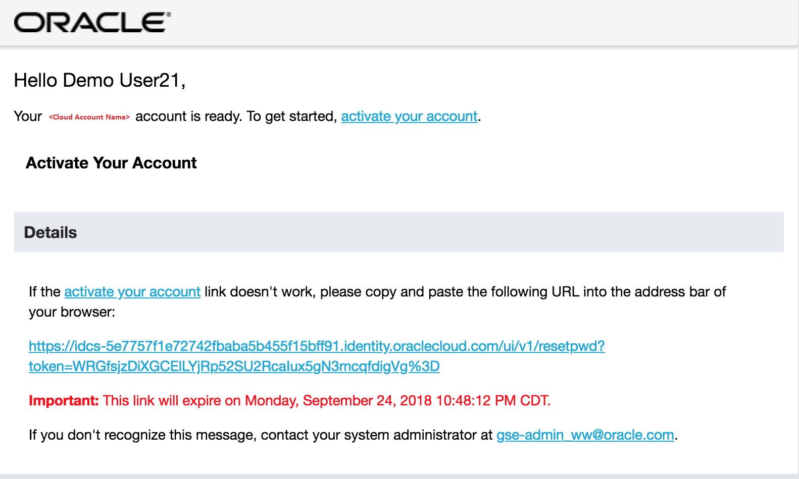

 
Step 2:   Set a new password which meets the Password Criteria  

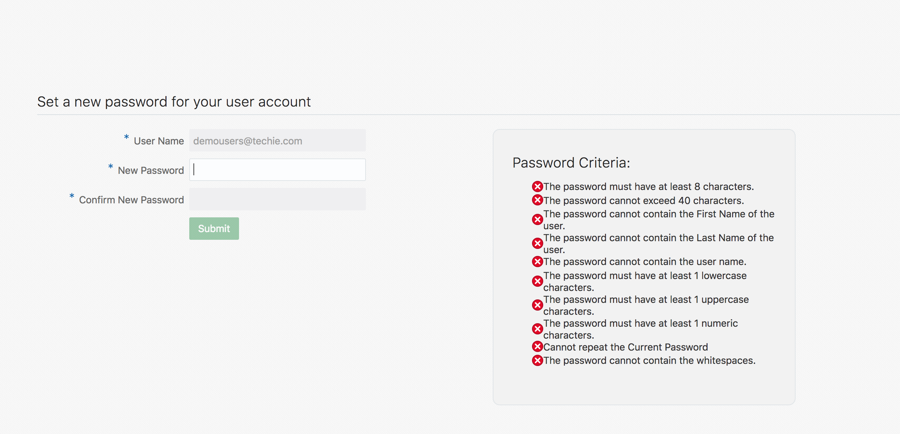

Step 3:  You will land on the Identity Cloud Service home page after successfully creating your new password
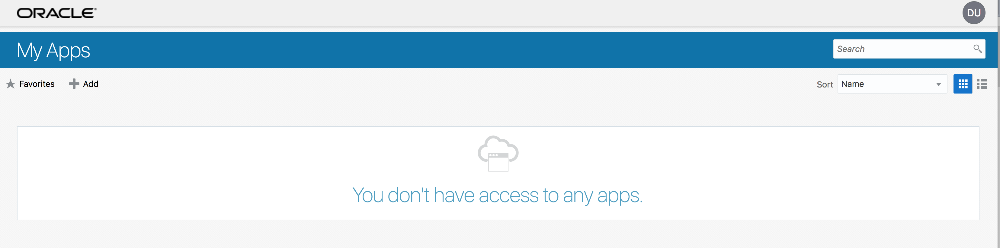
 

You have not been assigned any apps yet so you will need to provision an instance of Self Service Integration Cloud Service (SSI) next.

Step 4:  To do this, browse to http://cloud.oracle.com and click on the Sign In link
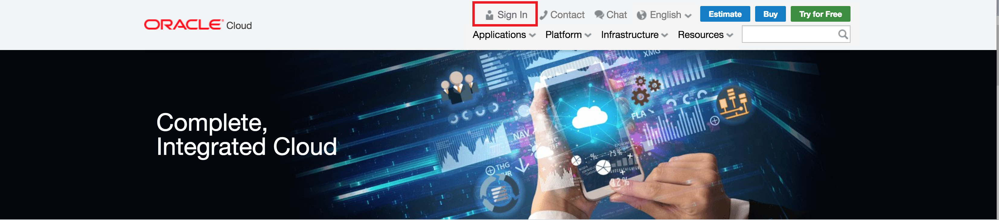

 

Step 5:  Enter in your Cloud Account name 
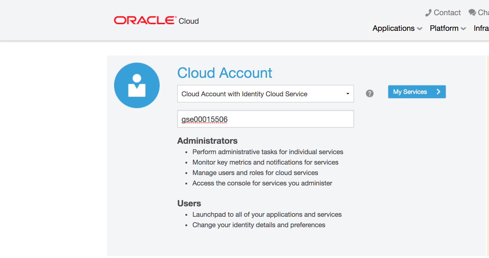
 

Next, depending on your Account type you may land on one of 2 possible Cloud Dashboard pages.

Step 6:  If your default page looks like this, then simply search for self and then click on the resulting Self-Service Integration option.  Skip to Step 10 if this page matches what you see otherwise go to step 7

 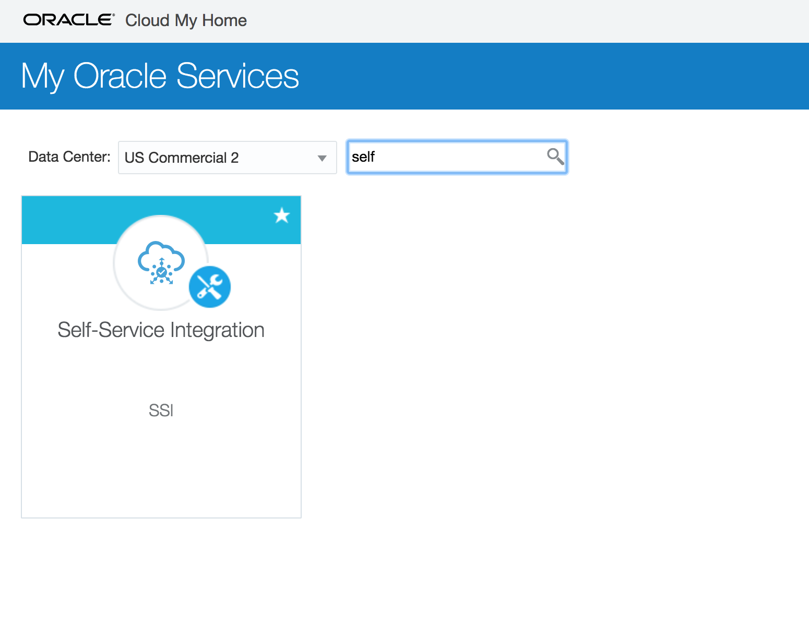

Step 7:  Alternatively, if your default page looks like this then you need to click on Customize Dashboard
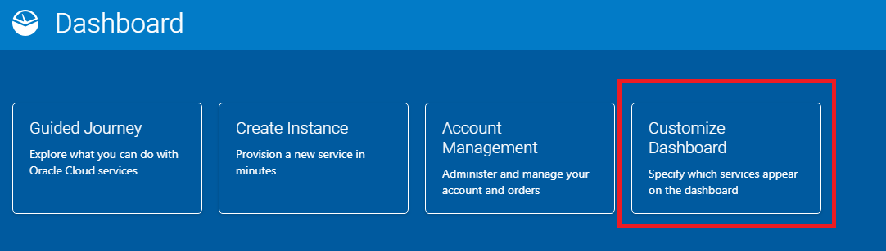
 

Step 8:  This will bring you to the Customize Dashboard page where you will scroll almost to the end of the page to locate Self-Service Integration and click on Show
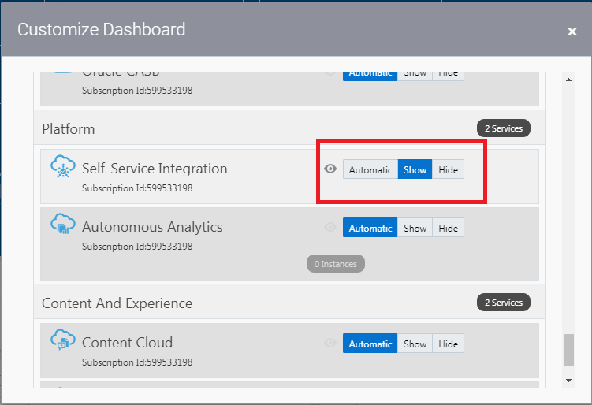
 

Step 9:  Now you will see a listing for Self-Service Integration which you can click on
 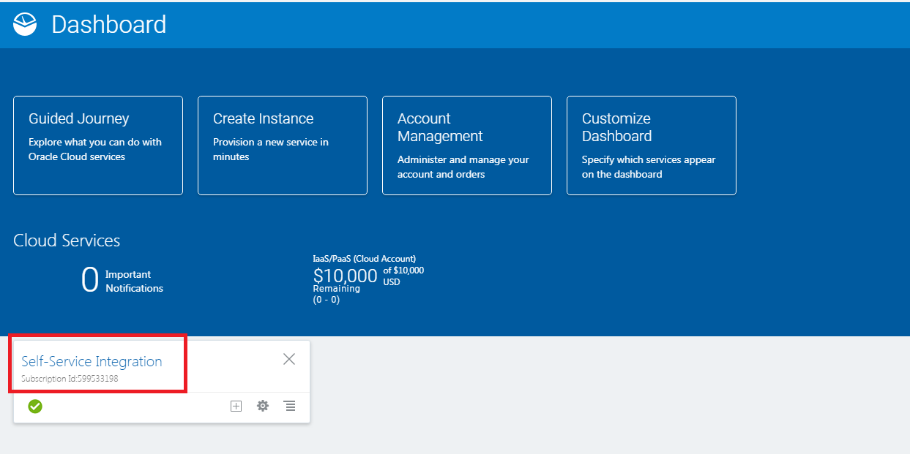

Step 10: Click Open Service Console
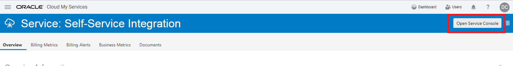

Step 11:  Click on Create Instance

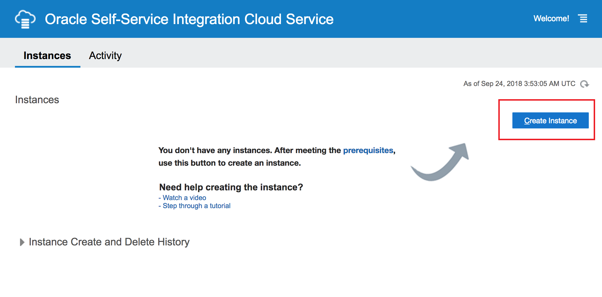

Step 12:  Enter in an Instance Name and Description (can be anything you want) and click Next
 
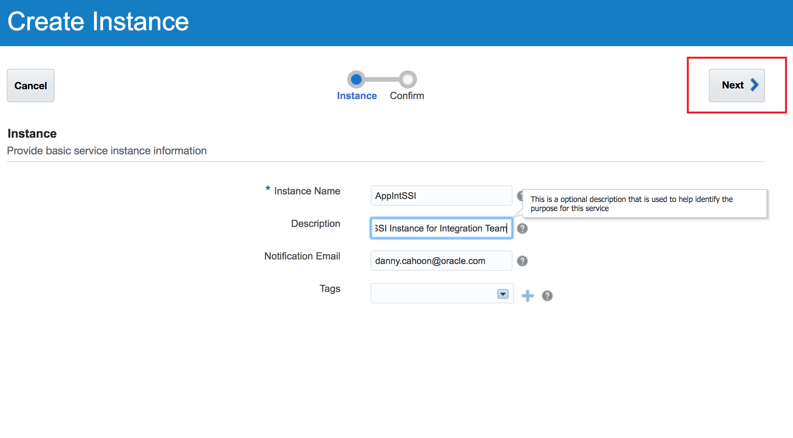

Step 13:  Confirm details and click Create
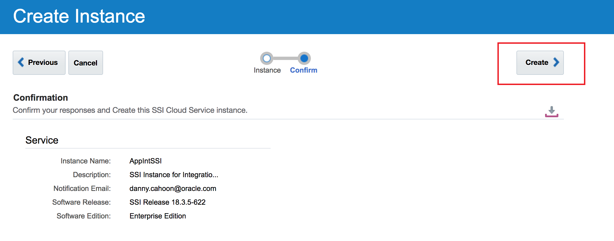

Step 14:  You can use the refresh button to check on status.  Once status shows that the instance has been provisioned you can use the hamburger menu to launch the SSI Console
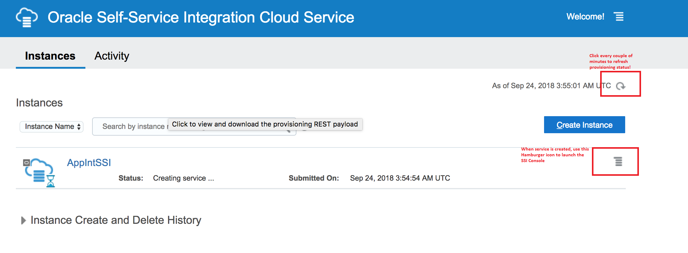

 
